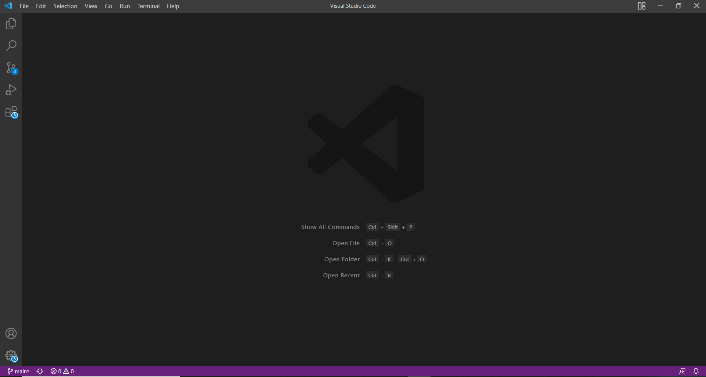
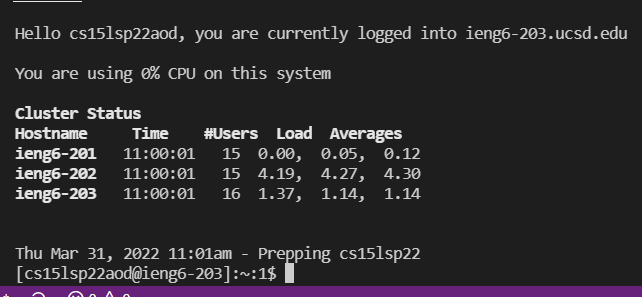
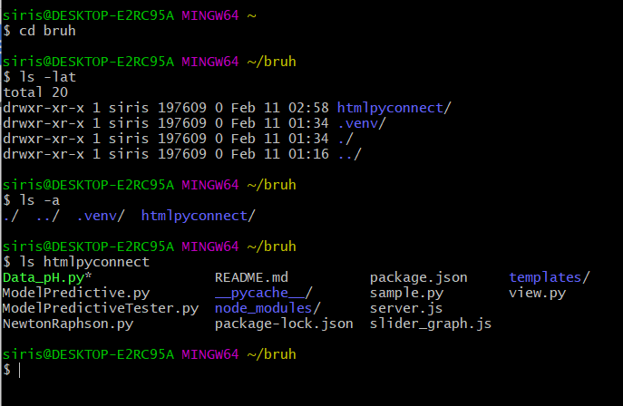
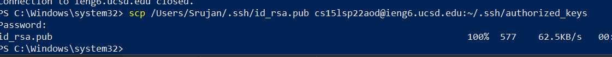
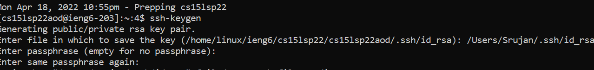
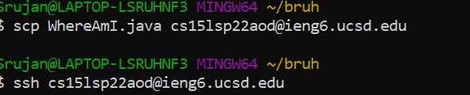

### **How to login and use course-specific account on ieng6**  

Google VSCode and download the vscode instance for your specific machine and then run the installation software which is fairly straight forward  

ssh into the school server by doing cs15lsp22zz@ieng6.ucsd.edu
replacing zz with your specific code

Try some simple linux commands like cd, ls, cp, etc

Copy some files over to the server using the same format in the picture above,
replace my name with your name
  
use the command ssh-keygen in windows powershell while running on adminstrator 
then use this [link](https://docs.microsoft.com/en-us/windows-server/administration/openssh/openssh_keymanagement#user-key-generation) to do ssh-add  
You do this for windows machines specifically  
  
A simple way to overwrite the file on the server is scp -f and similar to the previous scp example
