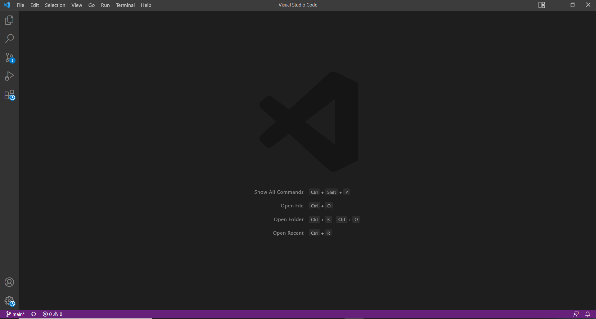
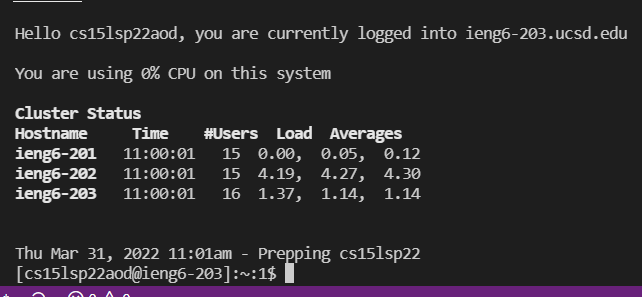
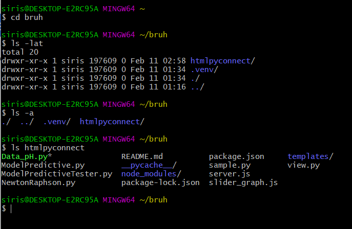

# **How to login and use course-specific account on ieng6**
---
### Installing VScode

Google VSCode and download the vscode instance for your specific machine and then run the installation software which is fairly straight forward  
### Remotely Connecting
  
ssh into the school server by doing cs15lsp22zz@ieng6.ucsd.edu
replacing zz with your specific code
### Trying Some Commands
  
Try some simple linux commands
- ls (shows what is in the directory)
- ls -lat (shows all files listed by date)
- cd (changes directory)
- cp (copies the file into another directory)
### Moving Files with scp
  
Copy some files over to the server using the same format in the picture above,
replace my name with your name
### Setting an SSH Key
  
use the command ssh-keygen in windows powershell while running on adminstrator 
then use this [link](https://docs.microsoft.com/en-us/windows-server/administration/openssh/openssh_keymanagement#user-key-generation) to do ssh-add  
You do this for windows machines specifically 
### Optimizing Remote Running
  
A simple way to overwrite the file on the server is scp -f and similar to the previous scp example
