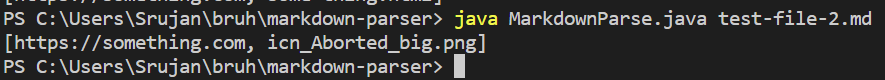
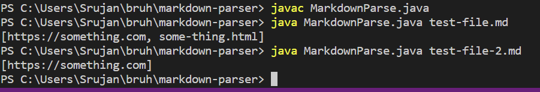
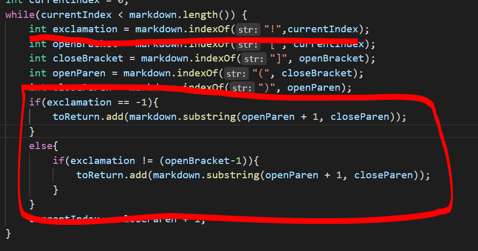
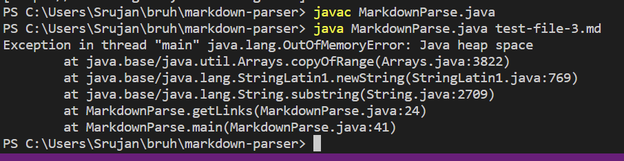
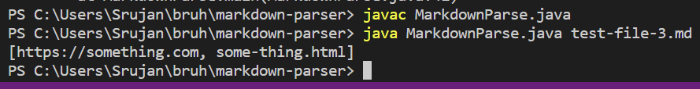
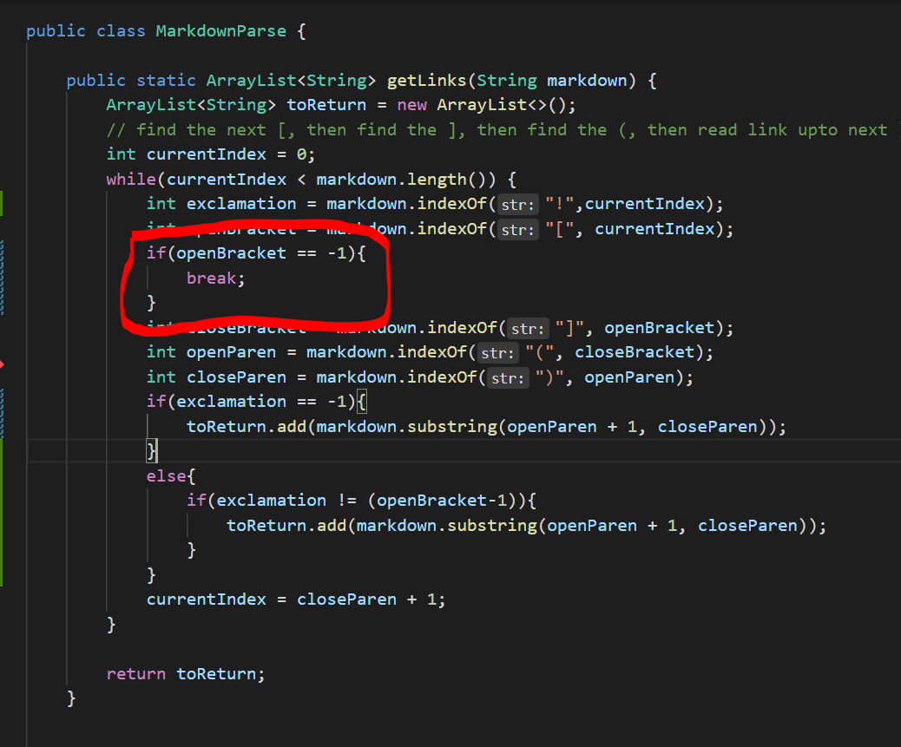
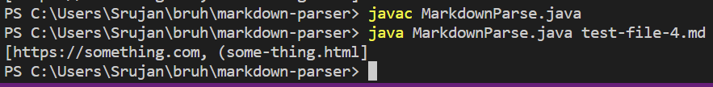
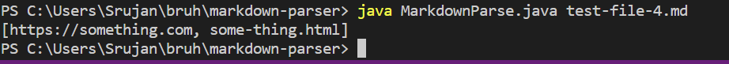
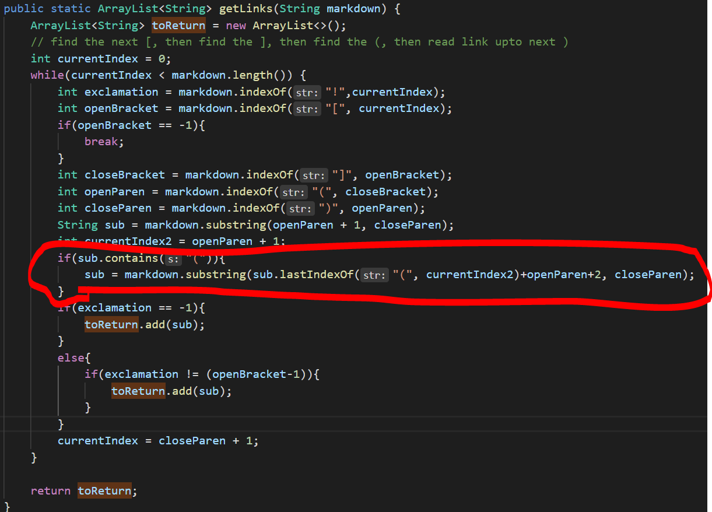

# **Lab report 2 week 4**
---  

### Code Change 1
  
- The error is that if there is an image it will instead of putting the link it will put the image [this](test-file-2.md) is the error.  

  

  

- The code can easily be fixed by checking if there is an exclamation mark right next to an open bracket.  

### Code Change 2
  
- The bug is if there is non brackets after the last parenthesis it will cause errors in the code and result in a compilation error [this](test-file-3.md) is the error.  

  

  

- The code is fixed pretty much by checking if there is anymore openBrackets left in the markdown file.  

### Code Change 3
  
- The bug results in extra parenthesis in the links instead of just the links [this](test-file-4.md) is the error.  

  

  

- The code is fixed by checking the string that will be output to the array if it has any open parenthesis or not, closing parenthesis are filtered out by previous bug fixes.  
