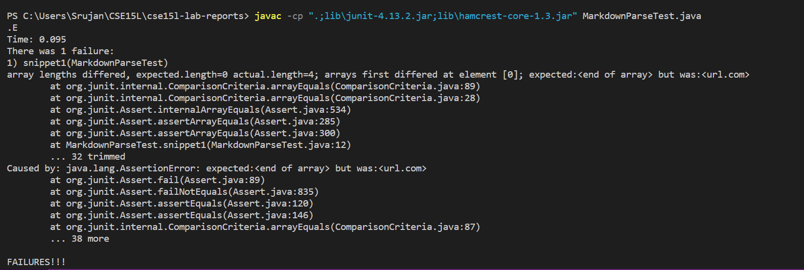
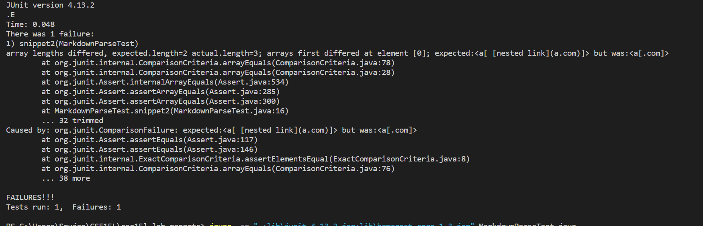
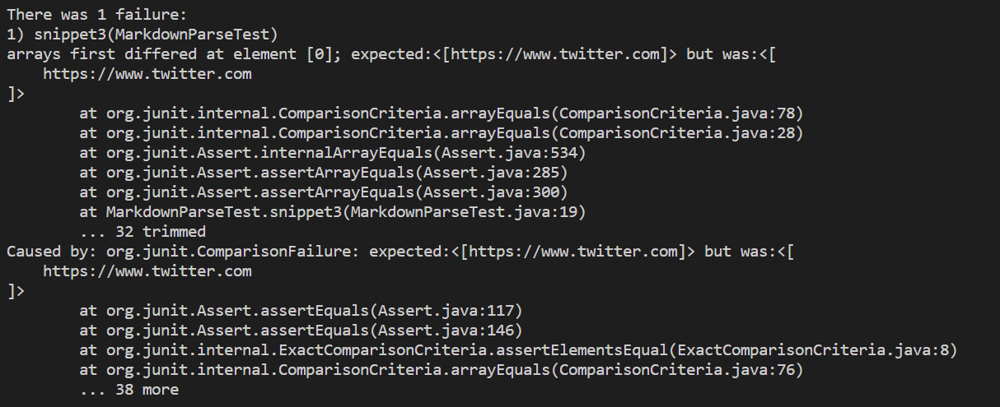
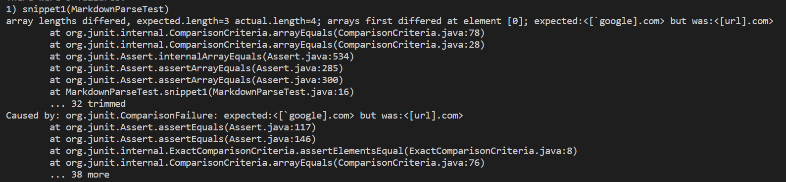
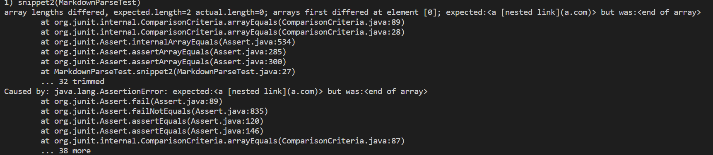
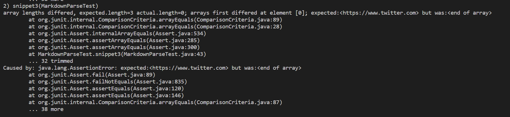

# **Lab report 4 week 8**  
---

## Repos  
[My Markdown Parse Repository](https://github.com/SrujanGutta/cse15l-lab-reports/tree/main/lab-report-2-week-4)  
[Repository Reviewed Week 7](https://github.com/cbaeucsd/markdown-parser)  

---  
## Snippet Expected Outputs  
### Snippet 1:  
[`google.com, google.com, ucsd.edu]
### Snippet 2:
[a.com, a.com(()), example.com] 
### Snippet 3:
[```https://www.twitter.com```, ```https://sites.google.com/eng.ucsd.edu/cse-15l-spring-2022/schedule```, ```https://cse.ucsd.edu/```] 
  
These outputs were obtained by looking at the visual studio preview to see which ones had turned to links.
  
---  
## My Implementation outputs

### Snippet 1:  
  
  
I believe the way I can fix the problems with the code by ignoring any link with a bracket that has a ` right before it
### Snippet 2:  
  
  
I think the nested parenthesis causes a big issue which im not sure can be fixed by <10 lines of code. I think if I was going to go about fixing it I would change my code to look for the format from the reverse direction, I would find all the [ and start from the back and look for the matches to it that is if I have  
[[[  
    I would look at the 3rd hard bracket first and search for a match for it first  
### Snippet 3:  
  

I think I would need to change the code to remove the newline characters from the url's that the code returns, otherwise I think it would be fine. So I would have to iterate through the url found and search for the \n character and then delete it from the string.
  
---
## Other Person's Implementation outputs  

## Snippet 1:  
  

## Snippet 2:  
  

## Snippet 3:  
  