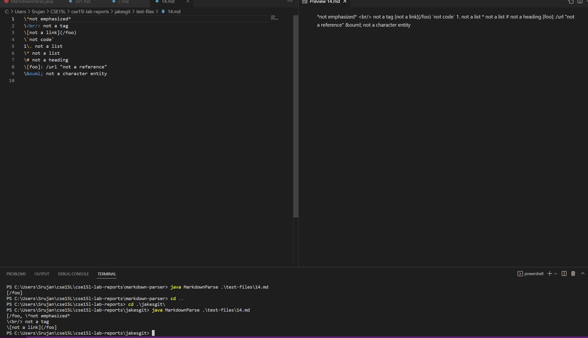
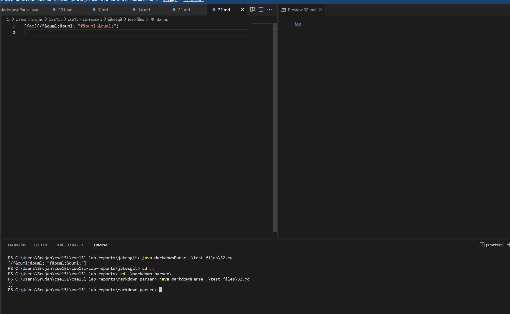
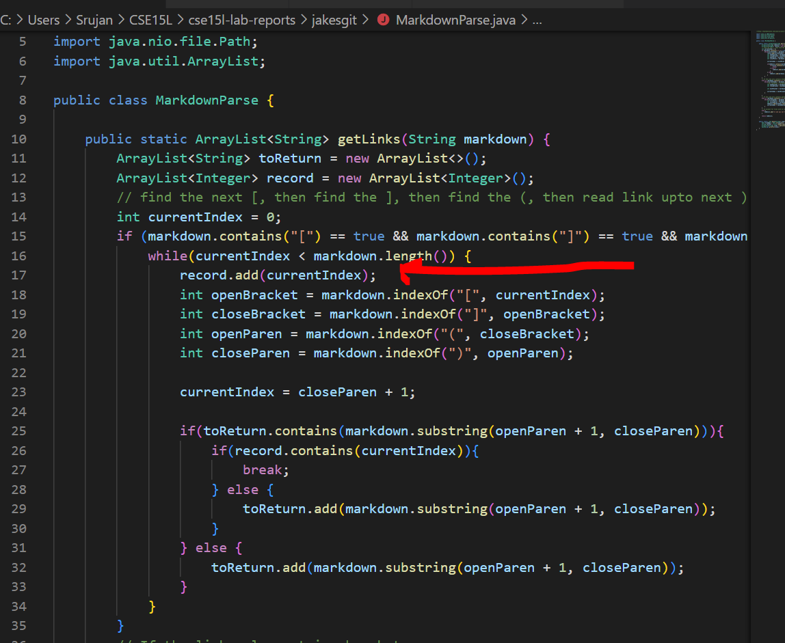
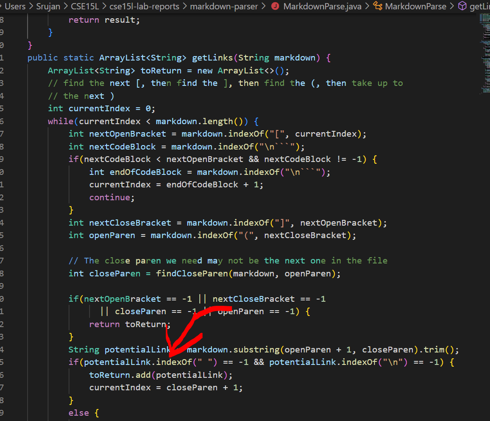

# **Lab report 5 week 10**  
---

## Repos/Test Files  
[Group Markdown Parse Repo](https://github.com/ahewig/markdown-parser)  
[Repository Reviewed Week 9](https://github.com/nidhidhamnani/markdown-parser)  
[TestFile 14](https://github.com/nidhidhamnani/markdown-parser/blob/main/test-files/14.md)  
[TestFile 32](https://github.com/nidhidhamnani/markdown-parser/blob/main/test-files/32.md)

---  
## Test Expected Outputs  
### Test 14:  
[]
### Test 32:
[```/f&ouml;&ouml; "f&ouml;&ouml;"```]  
  
These outputs were obtained by looking at the visual studio preview to see which ones had turned to links.  
  

The tests were obtained by searching for tests that seemed like they would cause bugs that would most likely not be fixed by either implementation.
  
---  
## Group Implementation and Provided Implementation outputs

### Test 14:  
  
  
For Test 14 both of the codes will output errors since this markdown file should have no links yet both return that a link exists. The visual studio preview clearly shows there is no link in the markdown file.
### Test 32:  
  

For Test 32 Jake's(the person who our groups repo is under) implementation of markdown parse results in the correct answer but the provided markdown parse from week 9 results in an empty output, assuming that there is no link there. The visual studio preview clearly shows there is a link there.  
  
---  
## Fixes for each Test
  
### Test 14:  

The best fix for this would be to add a segment of code to both markdown parser files to check for the ```\``` escape character so that it will be able to tell if there is a ```\``` to ignore the line when searching for the link. In both of the markdown parse files I would add the code in the same area, pretty much right after the while loop and it would check if for every new line in the code if there is a ```\``` and if so to ignore the line.

### Test 32:  

The error for this one only presented itself in the given markdown parse file I believe it is due to the portion that I highlighted I removed the if else block and just put the part inside the if block in the code and then the markdown-parser implementation works so I believe the if statement needs to be further refined to check if the quotation marks are actually inside the link parenthesis fully, in that case its a valid link according to markdown.